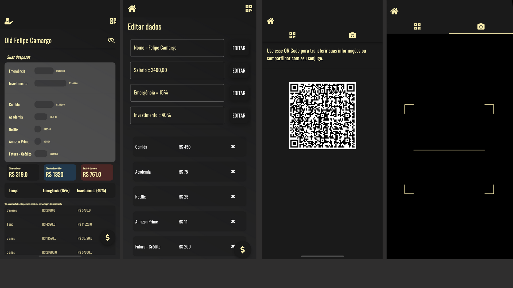

# Finance

Front-end project using Flutter e persisting Data with GetX.

### 💻  Requirements:

* Any Operating System (MacOS, Linux, Windows)
* Any IDE with Flutter SDK installed (Android Studio, VSCode etc)
* A little knowledge of Dart and Flutter

 ### 👨‍💻  Author

 - https://github.com/camargolfelipe

# Screenshot:

